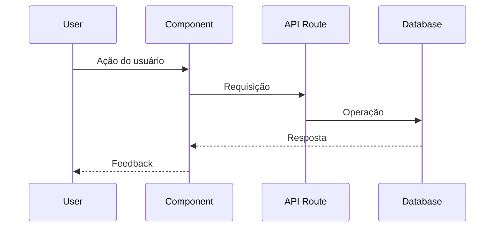

# Design Document - [Feature Name]

## Overview

[Descrição técnica da feature, incluindo tecnologias principais e princípios de design]

### Princípios de Design
- **Princípio 1**: Descrição do princípio
- **Princípio 2**: Descrição do princípio
- **Princípio 3**: Descrição do princípio

## Architecture

```mermaid
graph TB
    subgraph "Frontend (Next.js)"
        A[Component A] --> B[Service Layer]
        C[Component B] --> B
    end
    
    subgraph "API Layer"
        B --> D[/api/route]
        D --> E[Prisma Client]
    end
    
    subgraph "Database (Supabase)"
        E --> F[(PostgreSQL)]
    end
```

### Fluxo Principal


## Components and Interfaces

### Frontend Components

```typescript
// src/components/[feature]/[Component].tsx
interface ComponentProps {
  prop1: string;
  prop2: number;
  onAction: (data: any) => void;
}
```

### Service Interfaces

```typescript
// src/services/[feature].ts
interface FeatureService {
  method1(): Promise<Result>;
  method2(data: Input): Promise<Result>;
}
```

## Data Models

### Prisma Schema Extensions

```prisma
model Example {
  id        String   @id @default(uuid())
  createdAt DateTime @default(now()) @map("created_at")
  updatedAt DateTime @updatedAt @map("updated_at")
  
  @@map("examples")
}
```

### TypeScript Types

```typescript
// src/types/[feature].ts
interface ExampleType {
  field1: string;
  field2: number;
}
```

## Correctness Properties

### Property 1: [Nome da propriedade]
*Descrição formal do comportamento esperado*
**Validates: Requirements X.Y, X.Z**

### Property 2: [Nome da propriedade]
*Descrição formal do comportamento esperado*
**Validates: Requirements X.Y*

## Error Handling

### Client-Side Errors
| Error | Handling |
|-------|----------|
| Error 1 | Strategy 1 |
| Error 2 | Strategy 2 |

### Server-Side Errors
| Error | HTTP Status | Response |
|-------|-------------|----------|
| Error 1 | 400 | `{ error: "ERROR_CODE", message: "..." }` |

### Validation with Zod

```typescript
// src/lib/validations/[feature].ts
import { z } from "zod";

export const exampleSchema = z.object({
  field1: z.string().min(1),
  field2: z.number().positive(),
});
```

## Testing Strategy

### Property-Based Tests
- **Library**: fast-check
- **Minimum iterations**: 100 per property test

### Unit Tests
- Service layer functions
- Validation schemas
- Utility functions

### Integration Tests
- API route handlers
- End-to-end flows
