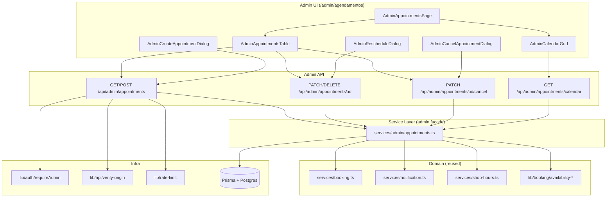

# Design Document - Admin Appointment Management

## Overview

Este design entrega ao admin uma camada HTTP + UI de gestao de agendamentos reutilizando 100% da logica de dominio de `src/services/booking.ts` (2108 linhas). Nao duplicamos regras de disponibilidade, advisory-lock, ou validacao de slots: criamos uma fina camada `src/services/admin/appointments.ts` que orquestra os servicos existentes com contexto admin, adiciona o bypass de janela de cancelamento (Requisito 3), registra audit fields e expoe filtros/paginacao.

A UI vive em `src/app/[locale]/(protected)/admin/agendamentos/` e segue o padrao ja estabelecido em `src/app/[locale]/(protected)/admin/barbeiros/BarbeirosPageClient.tsx` (client component paginado com React Query).

## Architecture



## Routes

### Nova area admin

```
src/app/[locale]/(protected)/admin/agendamentos/
├── page.tsx                         # Server component; renderiza client
├── AgendamentosPageClient.tsx       # Client component com Tabs: "Lista" / "Calendario"
├── calendario/
│   └── page.tsx                     # Deep-link opcional para view=calendar
└── __tests__/
    └── page.test.tsx                # Render + tabs
```

### Novas rotas API

```
src/app/api/admin/appointments/
├── route.ts                         # GET (list) + POST (create)
├── [id]/
│   ├── route.ts                     # PATCH (reschedule) + DELETE (hard cancel — não usado; placeholder)
│   └── cancel/
│       └── route.ts                 # PATCH (cancel com bypass)
├── calendar/
│   └── route.ts                     # GET (grade consolidada)
└── __tests__/
    ├── list.route.test.ts
    ├── create.route.test.ts
    ├── cancel.route.test.ts
    ├── reschedule.route.test.ts
    └── calendar.route.test.ts
```

## Components and Interfaces

### Zod schemas — `src/lib/validations/admin-appointments.ts`

```typescript
import { z } from "zod";
import { AppointmentStatus } from "@prisma/client";

export const listAdminAppointmentsQuerySchema = z.object({
  startDate: z.string().regex(/^\d{4}-\d{2}-\d{2}$/).optional(),
  endDate: z.string().regex(/^\d{4}-\d{2}-\d{2}$/).optional(),
  barberId: z.string().uuid().optional(),
  status: z.nativeEnum(AppointmentStatus).optional(),
  q: z.string().trim().min(1).max(100).optional(),
  orderBy: z.enum(["date", "startTime", "createdAt", "status"]).default("date"),
  orderDir: z.enum(["asc", "desc"]).default("desc"),
  page: z.coerce.number().int().min(1).default(1),
  limit: z.coerce.number().int().min(1).max(100).default(20),
});

export const adminCreateAppointmentSchema = z
  .object({
    barberId: z.string().uuid(),
    serviceId: z.string().uuid(),
    date: z.string().regex(/^\d{4}-\d{2}-\d{2}$/),
    startTime: z.string().regex(/^\d{2}:\d{2}$/),
    clientProfileId: z.string().uuid().optional(),
    guest: z
      .object({
        name: z.string().min(2).max(100),
        phone: z.string().min(8).max(20),
      })
      .optional(),
  })
  .refine(
    (d) => Boolean(d.clientProfileId) !== Boolean(d.guest),
    { message: "Informe clientProfileId OU guest, nunca ambos." },
  );

export const adminCancelAppointmentSchema = z.object({
  reason: z.string().trim().min(3).max(300),
});

export const adminRescheduleAppointmentSchema = z.object({
  date: z.string().regex(/^\d{4}-\d{2}-\d{2}$/).optional(),
  startTime: z.string().regex(/^\d{2}:\d{2}$/).optional(),
  barberId: z.string().uuid().optional(),
});

export const calendarQuerySchema = z.object({
  view: z.enum(["day", "week"]),
  date: z.string().regex(/^\d{4}-\d{2}-\d{2}$/),
  barberIds: z
    .string()
    .optional()
    .transform((s) => (s ? s.split(",") : undefined)),
});
```

### Service facade — `src/services/admin/appointments.ts`

```typescript
import { prisma } from "@/lib/prisma";
import * as booking from "@/services/booking";
import * as notify from "@/services/notification";
import type { Prisma, AppointmentStatus } from "@prisma/client";

export interface AdminListFilters {
  startDate?: string;
  endDate?: string;
  barberId?: string;
  status?: AppointmentStatus;
  q?: string;
  orderBy: "date" | "startTime" | "createdAt" | "status";
  orderDir: "asc" | "desc";
  page: number;
  limit: number;
}

export interface AdminAppointmentRow {
  id: string;
  date: string; // "YYYY-MM-DD"
  startTime: string;
  endTime: string;
  status: AppointmentStatus;
  cancelReason: string | null;
  barber: { id: string; name: string };
  service: { id: string; name: string; price: number; duration: number };
  client: { id: string; fullName: string; phone: string | null } | null;
  guestClient: { id: string; name: string; phone: string } | null;
  createdAt: Date;
  updatedAt: Date;
}

export async function listAppointmentsForAdmin(
  filters: AdminListFilters,
): Promise<{ rows: AdminAppointmentRow[]; total: number }>;

export async function createAppointmentAsAdmin(
  input: AdminCreateInput,
  adminProfileId: string,
): Promise<AdminAppointmentRow>;

/**
 * Bypassa `CANCELLATION_BLOCKED` (janela 2h) mas NAO bypassa:
 * - APPOINTMENT_IN_PAST
 * - APPOINTMENT_NOT_CANCELLABLE (ja cancelado)
 * Setta status=CANCELLED_BY_BARBER, cancelReason="[ADMIN] <reason>",
 * cancelledBy=adminProfileId, source="ADMIN".
 */
export async function cancelAppointmentAsAdmin(
  appointmentId: string,
  reason: string,
  adminProfileId: string,
): Promise<AdminAppointmentRow>;

/**
 * Delega para o servico exposto pela spec `booking-reschedule`.
 * Enquanto essa spec nao esta merged, retorna erro NOT_IMPLEMENTED.
 */
export async function rescheduleAppointmentAsAdmin(
  appointmentId: string,
  target: { date?: string; startTime?: string; barberId?: string },
  adminProfileId: string,
): Promise<AdminAppointmentRow>;

export interface CalendarGrid {
  barbers: Array<{ id: string; name: string }>;
  slots: Array<{
    barberId: string;
    date: string;
    startTime: string;
    endTime: string;
    blocked: boolean;
    reason?: string; // "SHOP_CLOSED" | "BARBER_ABSENT" | "BARBER_UNAVAILABLE"
    appointment?: AdminAppointmentRow;
  }>;
}

export async function getCalendarForAdmin(args: {
  view: "day" | "week";
  date: string;
  barberIds?: string[];
}): Promise<CalendarGrid>;
```

### Route handlers

Todos seguem o padrao de `src/app/api/admin/barbers/route.ts` e `src/app/api/appointments/route.ts`:

1. `requireAdmin()` (early return)
2. `requireValidOrigin(request)` para mutacoes
3. `checkRateLimit("admin-appointments", clientId)` para mutacoes
4. Zod `safeParse` do body/query
5. Chamada ao service facade
6. Mapeamento de erros de dominio para codigos padronizados
7. `apiSuccess` / `apiCollection` / `apiError` de `src/lib/api/response.ts`

Exemplo mapa de erros admin (extensao do mapa ja em `src/app/api/appointments/route.ts:197-238`):

| Erro dominio | HTTP | Admin bypass |
|--------------|------|--------------|
| `SLOT_OCCUPIED` | 409 | Nao |
| `SLOT_IN_PAST` | 400 | Nao |
| `SLOT_TOO_SOON` | N/A | Nao aplicavel (admin respeita SHOP_CLOSED mas nao lead time de cliente) |
| `SHOP_CLOSED` | 400 | Nao |
| `BARBER_UNAVAILABLE` | 400 | Nao |
| `CANCELLATION_BLOCKED` | N/A | **Sim — bypass** |
| `APPOINTMENT_IN_PAST` | 400 | Nao |
| `APPOINTMENT_NOT_CANCELLABLE` | 400 | Nao |
| `PROFILE_NOT_FOUND` | 404 | — |
| `NOT_IMPLEMENTED` (reschedule stub) | 501 | — |

### UI components — `src/components/admin/appointments/`

```
AdminAppointmentsTable.tsx           # Lista com filtros/paginacao
AdminAppointmentsFilters.tsx         # Barra de filtros (date range, barber, status, q)
AdminCalendarGrid.tsx                # Grid barbeiros x slots (dia) / matriz (semana)
AdminCalendarSlot.tsx                # Cell clicavel (livre/ocupado/bloqueado)
AdminAppointmentDrawer.tsx           # Painel lateral com detalhes + acoes
AdminCreateAppointmentDialog.tsx     # Modal criacao manual (autocomplete cliente ou guest)
AdminCancelAppointmentDialog.tsx     # Modal cancelamento com motivo obrigatorio
AdminRescheduleDialog.tsx            # Modal reagendamento (stub ate booking-reschedule)
```

Padrao de estado: React Query para fetching (cache por filtros), `useState` local para filtros/ui, Sonner para toasts, react-hook-form + zod para formularios (segue `src/components/auth/`).

## Data Models

### Migration Prisma — campos de auditoria em `Appointment`

```prisma
model Appointment {
  id              String            @id @default(uuid())
  // ... campos existentes ...

  // NOVOS — auditabilidade (Requisito 7.4)
  source          AppointmentSource @default(CLIENT)
  createdBy       String?           @map("created_by")      // Profile.id do admin/barbeiro que criou
  cancelledBy     String?           @map("cancelled_by")    // Profile.id de quem cancelou
  rescheduledBy   String?           @map("rescheduled_by")  // Profile.id de quem reagendou (ultima vez)

  @@index([source])
}

enum AppointmentSource {
  CLIENT       // default — auto-servico
  BARBER       // barbeiro criou para si mesmo
  ADMIN        // admin criou em nome do cliente
  GUEST        // fluxo guest
  IMPORT       // reservado para cargas futuras
}
```

> Os novos campos sao todos opcionais/com default — a migration nao quebra dados existentes.

### Reuso de dominio

Os seguintes modulos continuam sendo a fonte unica de verdade e **nao sao modificados** por esta spec, exceto os campos de auditoria acima:

- `src/services/booking.ts:619` `createAppointment` — criacao com cliente autenticado.
- `src/services/booking.ts:934` `createAppointmentByBarber` — criacao com guest.
- `src/services/booking.ts:1330` `cancelAppointmentByClient` — cancelamento cliente.
- `src/services/booking.ts:1427` `cancelAppointmentByBarber` — cancelamento barbeiro com motivo.
- `src/lib/booking/availability-policy.ts`, `availability-windows.ts`, `cancellation.ts`, `slots-policy.ts` — politicas puras.

A facade admin extrai a logica de persistencia comum para uma nova funcao internal em `booking.ts` (ex: `cancelAppointmentInternal`) que aceita `{ actor: "ADMIN", bypassCancelWindow: true }`, de modo que `cancelAppointmentByBarber` passe a ser uma chamada fina com `bypassCancelWindow: false` e o admin use `true`. Assim o bypass NAO vive no admin service, mas num flag privado do dominio, preservando a barreira.

## Correctness Properties

### Property 1: Listagem retorna apenas agendamentos no intervalo solicitado

*For any* `listAdminAppointmentsQuerySchema` com `startDate`, `endDate` validos, toda row retornada em `rows` SHALL satisfazer `row.date >= startDate AND row.date <= endDate`.

**Validates: Requirements 1.2**

### Property 2: Filtro por barbeiro e status e exclusivo

*For any* `{ barberId, status }` informados, toda row retornada SHALL satisfazer `row.barber.id === barberId AND row.status === status`.

**Validates: Requirements 1.3, 1.4**

### Property 3: Criacao admin rejeita dois identificadores simultaneos

*For any* input com `clientProfileId` E `guest` preenchidos ao mesmo tempo, `adminCreateAppointmentSchema` SHALL rejeitar com erro de validacao.

**Validates: Requirements 2.1**

### Property 4: Cancelamento admin bypassa apenas janela de tempo

*For any* agendamento com `startTime` 1h no futuro e status CONFIRMED, `cancelAppointmentAsAdmin` SHALL ter sucesso (cliente/barbeiro receberiam `CANCELLATION_BLOCKED`). *For any* agendamento no passado ou ja cancelado, SHALL lancar `APPOINTMENT_IN_PAST` ou `APPOINTMENT_NOT_CANCELLABLE`.

**Validates: Requirements 3.1, 3.2**

### Property 5: Criacao admin preserva advisory-lock de colisao

*For any* tentativa concorrente de criar dois agendamentos com mesmo `barberId + date + startTime` (admin + cliente), no maximo um SHALL persistir; o outro SHALL receber `SLOT_OCCUPIED`.

**Validates: Requirements 2.4** (via reuso de `src/services/booking.ts:210`)

### Property 6: Apenas admin pode chamar as rotas

*For any* request sem sessao Supabase valida OU com `profile.role != ADMIN`, todas as rotas em `/api/admin/appointments/**` SHALL retornar 401 ou 403.

**Validates: Requirements 1.8, 7.1**

### Property 7: Calendario respeita limite de janela

*For any* query com intervalo > 14 dias, `GET /api/admin/appointments/calendar` SHALL retornar `RANGE_TOO_LARGE` 400.

**Validates: Requirements 5.7**

## Error Handling

### Server-side

| Cenario | Codigo | HTTP | Origem |
|---------|--------|------|--------|
| Sem sessao | `UNAUTHORIZED` | 401 | `requireAdmin` |
| Sessao sem role admin | `FORBIDDEN` | 403 | `requireAdmin` |
| Origin invalido | `FORBIDDEN` | 403 | `requireValidOrigin` |
| Excedeu rate limit | `RATE_LIMITED` | 429 | `checkRateLimit` |
| Query invalida | `VALIDATION_ERROR` | 400 | Zod |
| Body invalido | `VALIDATION_ERROR` | 422 | Zod |
| Slot ocupado | `SLOT_OCCUPIED` | 409 | `booking.ts` (advisory-lock) |
| Slot no passado | `SLOT_IN_PAST` | 400 | `booking.ts` |
| Shop fechado | `SHOP_CLOSED` | 400 | `availability-*` |
| Barbeiro indisponivel | `BARBER_UNAVAILABLE` | 400 | `availability-*` |
| Agendamento nao encontrado | `NOT_FOUND` | 404 | Prisma |
| Reagendamento sem spec | `NOT_IMPLEMENTED` | 501 | stub |
| Intervalo calendario grande | `RANGE_TOO_LARGE` | 400 | Zod+handler |
| Erro Prisma inesperado | `INTERNAL_ERROR` | 500 | `handlePrismaError` |

### Client-side (UI)

- Validacao inline via `react-hook-form` + resolvers zod.
- Toasts Sonner para sucesso/erro com i18n (`src/i18n/messages/pt-BR.json` -> adicionar namespace `admin.appointments`).
- Erro `SLOT_OCCUPIED` na criacao abre sugestao de slots livres via `GET /api/barbers/:id/slots` (endpoint existente).

## Testing Strategy

### Unit tests (Vitest)

- `src/lib/validations/admin-appointments.ts` — schemas (rejeicoes e aceitacoes).
- `src/services/admin/appointments.ts` — facade isolada com prisma mockado.

### Property-based (fast-check, ja em devDependencies)

- Property 1, 2, 3, 4, 7 (ver secao acima) com minimo 100 iteracoes.

### Integration tests

- `src/app/api/admin/appointments/__tests__/*.test.ts` — usam Supabase test client + Prisma em DB de teste.
- Concorrencia: criar 2 requests simultaneos para mesmo slot e verificar que exatamente 1 vence (Property 5).

### Seed

- Adicionar em `prisma/seed.ts` (ou novo `prisma/seed-admin.ts`) geracao de ~500 agendamentos sinteticos distribuidos em 3 barbeiros e 30 dias para bench e QA manual.

## Traceability

| Requisito | Servico | Rota | Componente UI | Teste |
|-----------|---------|------|----------------|-------|
| 1 — Listagem | `listAppointmentsForAdmin` | `GET /api/admin/appointments` | `AdminAppointmentsTable`, `AdminAppointmentsFilters` | `list.route.test.ts`, property 1/2 |
| 2 — Criacao | `createAppointmentAsAdmin` | `POST /api/admin/appointments` | `AdminCreateAppointmentDialog` | `create.route.test.ts`, property 3/5 |
| 3 — Cancelamento | `cancelAppointmentAsAdmin` | `PATCH /api/admin/appointments/:id/cancel` | `AdminCancelAppointmentDialog` | `cancel.route.test.ts`, property 4 |
| 4 — Reagendamento | `rescheduleAppointmentAsAdmin` | `PATCH /api/admin/appointments/:id` | `AdminRescheduleDialog` | `reschedule.route.test.ts` (stub ate `booking-reschedule`) |
| 5 — Calendario | `getCalendarForAdmin` | `GET /api/admin/appointments/calendar` | `AdminCalendarGrid`, `AdminCalendarSlot` | `calendar.route.test.ts`, property 7 |
| 6 — Paginacao | `listAppointmentsForAdmin` + `parsePagination` | `GET /api/admin/appointments` | `AdminAppointmentsTable` | `list.route.test.ts` (cenario 10k rows + bench) |
| 7 — Seguranca/audit | `requireAdmin`, `requireValidOrigin`, rate limit, migration `source/createdBy/cancelledBy/rescheduledBy` | todas | todas | property 6 + teste de autorizacao em cada rota |
