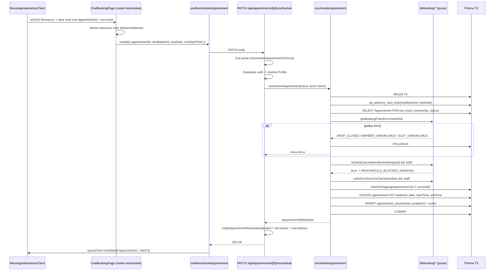
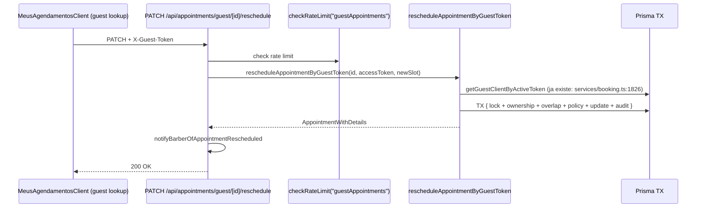
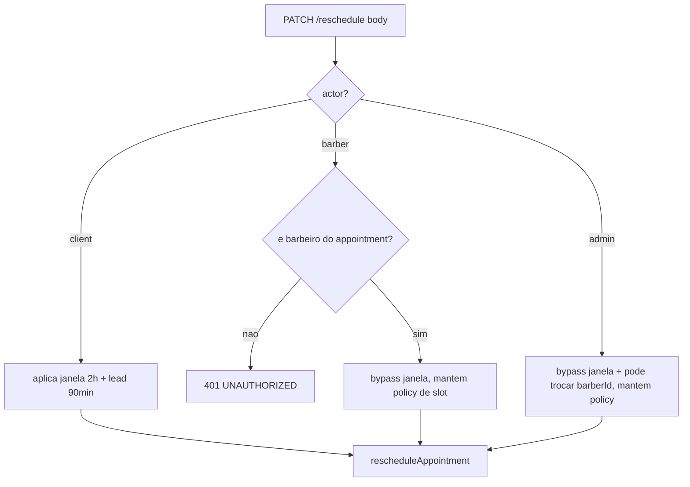

# Documento de Design - Booking Reschedule

## Overview

Adicionar a operacao **reschedule** ao sistema de booking sem duplicar logica. A estrategia central e:

1. Uma unica funcao nova no service layer: `rescheduleAppointment` em `src/services/booking.ts`, seguindo o mesmo shape de `createAppointment` (`src/services/booking.ts:619`), `createGuestAppointment` (`src/services/booking.ts:763`) e `cancelAppointmentByClient` (`src/services/booking.ts:1330`).
2. **Reuso total das politicas puras** ja existentes em `src/lib/booking/`:
   - `getWorkingHoursSlotError` (`src/lib/booking/slots-policy.ts`)
   - `getShopSlotError` / `getAbsenceSlotError` (`src/lib/booking/availability-policy.ts`)
   - `isSlotTooSoonForClient` (`src/lib/booking/lead-time.ts:1`)
   - `isClientCancellationBlocked` (janela de 2h) derivada de `canClientCancelOutsideWindow` (`src/lib/booking/cancellation.ts:16`)
   - `lockBarberDateForBooking` + `hasOverlappingAppointment` (`src/services/booking.ts:200`, `:226`)
3. Novo endpoint `PATCH /api/appointments/[id]/reschedule` (cliente/staff) e `PATCH /api/appointments/guest/[id]/reschedule` (guest), espelhando a estrutura dos endpoints de cancelamento (`src/app/api/appointments/[id]/cancel/route.ts` e `src/app/api/appointments/guest/[id]/cancel/route.ts`).
4. Nova tabela `AppointmentReschedule` para auditoria.
5. UI: botao "Remarcar" em `MeusAgendamentosClient.tsx` que abre o mesmo fluxo do chat de booking (`ChatBookingPage.tsx`) em modo "reschedule", pre-preenchendo `serviceId` e deixando o cliente trocar barbeiro/data/horario.

### Principios de Design

- **Nao duplicar politica**: qualquer regra de disponibilidade vive em `src/lib/booking/`. Service apenas orquestra + persiste.
- **Atomicidade**: todo o trabalho de dominio em uma `prisma.$transaction` com advisory lock, alinhado ao padrao de create.
- **Paridade de erros**: reuso dos mesmos codigos de erro (`SLOT_OCCUPIED`, `SHOP_CLOSED`, `BARBER_UNAVAILABLE`, `SLOT_UNAVAILABLE`, `SLOT_TOO_SOON`, `SLOT_IN_PAST`) para que o frontend reaproveite mensagens.
- **Mesmo id preservado**: `Appointment.id` nao muda. Isso simplifica: feedback, loyalty, notificacoes existentes continuam funcionando.
- **UI reaproveita chat flow**: em vez de criar um componente novo, passamos um `mode: "reschedule" | "create"` e um `appointmentId` opcional para `ChatBookingPage`.

## Architecture

### Fluxo de Reschedule (cliente autenticado)



### Fluxo de Reschedule (guest)



### Decision flow (staff bypass)



## Components and Interfaces

### Service layer (novo)

```typescript
// src/services/booking.ts  (nova funcao - NAO cria arquivo novo)

export type RescheduleActor = "client" | "guest" | "barber" | "admin";

export interface RescheduleAppointmentInput {
  appointmentId: string;
  newBarberId: string;
  newDate: string;       // "YYYY-MM-DD"
  newStartTime: string;  // "HH:MM"
  reason?: string;       // opcional, util para staff
}

export interface RescheduleAppointmentContext {
  actor: RescheduleActor;
  // Identidade resolvida pelo caller (API):
  clientProfileId?: string; // quando actor === "client"
  guestAccessToken?: string; // quando actor === "guest"
  barberId?: string; // quando actor === "barber" (Barber.id do autenticado)
  adminUserId?: string; // quando actor === "admin"
}

export async function rescheduleAppointment(
  input: RescheduleAppointmentInput,
  context: RescheduleAppointmentContext,
): Promise<AppointmentWithDetails> {
  /*
    Orquestracao:
    1. Validar que appointment existe e status == CONFIRMED
    2. Autorizacao por actor (ownership para client/guest/barber; admin sempre OK)
    3. Rejeitar same-slot reschedule (RESCHEDULE_UNCHANGED)
    4. Resolver service.duration (query simples) e calcular newEndTime
    5. Janela: se actor in ("client","guest") aplicar:
         - isClientCancellationBlocked(original) -> RESCHEDULE_BLOCKED_WINDOW
         - isSlotTooSoonForClient(new)           -> SLOT_TOO_SOON
         - isDateTimeInPast(new)                 -> SLOT_IN_PAST
    6. getBookingPolicyError(newSlot) (mesmos codigos)
    7. prisma.$transaction:
         - lockBarberDateForBooking(tx, newBarberId, newDateDb)
         - [se newBarberId != oldBarberId && newDate == oldDate, lock tambem o antigo
            em ordem deterministica para evitar deadlock]
         - hasOverlappingAppointment(tx, newBarberId, newDateDb, newStart, newEnd)
           excluindo { id: appointmentId }
         - tx.appointment.update({ where: { id }, data: { barberId, date, startTime, endTime }})
         - tx.appointmentReschedule.create({ snapshot + actor })
    8. return AppointmentWithDetails (mesmo formato das outras funcoes do service).
  */
}
```

Observacoes de implementacao:

- A versao "ByGuestToken" pode ser um wrapper fino: `rescheduleAppointmentByGuestToken(id, token, newSlot)` resolve o guest via `getGuestClientByActiveToken` e chama `rescheduleAppointment(..., { actor: "guest", ... })`. Evita duplicar logica.
- `hasOverlappingAppointment` precisa aceitar um parametro opcional `excludeAppointmentId`. Alteracao minima em `src/services/booking.ts:226` (nao quebra call sites: default `undefined`).

### API Routes

```typescript
// src/app/api/appointments/[id]/reschedule/route.ts  (NOVO)
export async function PATCH(
  request: Request,
  { params }: { params: Promise<{ id: string }> },
) {
  // 1. requireValidOrigin
  // 2. Supabase auth; se nao autenticado -> 401
  // 3. Zod: rescheduleAppointmentSchema (ver validations)
  // 4. Resolve actor: staff path se o user.id corresponde a Barber.userId dono do apt,
  //    ou admin (role a definir no spec admin-appointment-management).
  //    Caso contrario: client path (exige Profile linkado ao user).
  // 5. call rescheduleAppointment + map dos erros de dominio para apiError
  //    (reaproveita o mesmo mapa de erros de cancel/create).
  // 6. Notify (cliente + barbeiro velho + barbeiro novo quando aplicavel).
}

// src/app/api/appointments/guest/[id]/reschedule/route.ts  (NOVO)
export async function PATCH(
  request: Request,
  { params }: { params: Promise<{ id: string }> },
) {
  // 1. requireValidOrigin + checkRateLimit("guestAppointments")
  // 2. Le X-Guest-Token; ausente -> MISSING_TOKEN
  // 3. Zod: rescheduleGuestAppointmentSchema
  // 4. call rescheduleAppointmentByGuestToken
  // 5. Notify barbeiro antigo/novo (guest nao recebe notificacao in-app)
}
```

Mapa de erros (mesmo padrao de `src/app/api/appointments/[id]/cancel/route.ts:146`):

| Error domain                   | HTTP | Mensagem pt-BR                                                |
|-------------------------------|------|--------------------------------------------------------------|
| APPOINTMENT_NOT_FOUND         | 404  | Agendamento nao encontrado                                    |
| APPOINTMENT_NOT_RESCHEDULABLE | 400  | Este agendamento nao pode ser remarcado                       |
| RESCHEDULE_BLOCKED_WINDOW     | 400  | Nao e possivel remarcar a menos de 2 horas do horario         |
| RESCHEDULE_UNCHANGED          | 400  | O novo horario e igual ao atual                               |
| SLOT_TOO_SOON                 | 400  | O novo horario e cedo demais (minimo 90 minutos)              |
| SLOT_IN_PAST                  | 400  | O novo horario ja passou                                      |
| SLOT_OCCUPIED                 | 409  | Este horario acabou de ser ocupado                            |
| SHOP_CLOSED                   | 400  | A barbearia estara fechada neste horario                      |
| BARBER_UNAVAILABLE            | 400  | Barbeiro indisponivel neste horario                           |
| SLOT_UNAVAILABLE              | 400  | Horario indisponivel                                          |
| UNAUTHORIZED                  | 401/403 | Voce nao pode remarcar este agendamento                    |
| GUEST_TOKEN_CONSUMED          | 401  | Token guest ja consumido                                      |

### Validations (Zod)

```typescript
// src/lib/validations/booking.ts (adicionar - NAO substituir)
export const rescheduleAppointmentSchema = z.object({
  newBarberId: z.string().uuid("ID do barbeiro invalido"),
  newDate: z.string().regex(/^\d{4}-\d{2}-\d{2}$/, "Data deve estar no formato YYYY-MM-DD"),
  newStartTime: z.string().regex(/^\d{2}:\d{2}$/, "Horario deve estar no formato HH:MM"),
  actor: z.enum(["client", "barber", "admin"]).optional(),
  reason: z.string().max(500, "Motivo deve ter no maximo 500 caracteres").optional(),
});
export type RescheduleAppointmentPayload = z.infer<typeof rescheduleAppointmentSchema>;

export const rescheduleGuestAppointmentSchema = z.object({
  newBarberId: z.string().uuid("ID do barbeiro invalido"),
  newDate: z.string().regex(/^\d{4}-\d{2}-\d{2}$/, "Data deve estar no formato YYYY-MM-DD"),
  newStartTime: z.string().regex(/^\d{2}:\d{2}$/, "Horario deve estar no formato HH:MM"),
});
export type RescheduleGuestAppointmentPayload = z.infer<typeof rescheduleGuestAppointmentSchema>;
```

### Hook

```typescript
// src/hooks/useBooking.ts  (adicionar)
export function useRescheduleAppointment() {
  const queryClient = useQueryClient();
  return useMutation({
    mutationFn: async (input: {
      appointmentId: string;
      newBarberId: string;
      newDate: string;
      newStartTime: string;
    }) =>
      apiMutate<AppointmentWithDetails>(
        `/api/appointments/${input.appointmentId}/reschedule`,
        "PATCH",
        {
          newBarberId: input.newBarberId,
          newDate: input.newDate,
          newStartTime: input.newStartTime,
          actor: "client",
        },
      ),
    onSuccess: () => queryClient.invalidateQueries({ queryKey: ["appointments"] }),
  });
}

export function useRescheduleGuestAppointment() { /* similar, envia X-Guest-Token */ }
```

### UI

- `src/app/[locale]/meus-agendamentos/components/UpcomingAppointments.tsx`: adicionar botao "Remarcar" ao lado de "Cancelar" para cada `AppointmentWithDetails` cujo `getAppointmentCancellationStatus(...).canCancel == true` (mesma regra da janela 2h). Visual: `variant="outline"` com icone `CalendarSync` (lucide).
- `src/components/booking/chat/ChatBookingPage.tsx`: aceitar nova prop `mode?: "create" | "reschedule"` e `rescheduleAppointmentId?: string`.
  - Em `reschedule`, o passo de "selecione servico" e pulado (`serviceId` vem do appointment atual).
  - Primeira mensagem do chat (`ChatMessage`) muda para "Para qual barbeiro/data/horario voce quer remarcar?".
  - No final, chama `useRescheduleAppointment` em vez de `useCreateAppointment`.
- Roteamento: botao "Remarcar" em `/meus-agendamentos` leva para `/agendar?reschedule=<appointmentId>`. A pagina de agendamento inspeciona a query string, carrega o appointment via `/api/appointments` (ja em cache), e instancia `ChatBookingPage` em modo reschedule.

## Data Models

### Prisma Schema - Novo modelo `AppointmentReschedule`

```prisma
// prisma/schema.prisma (adicionar abaixo de model Appointment)

model AppointmentReschedule {
  id                 String                @id @default(uuid())
  appointmentId      String                @map("appointment_id")
  previousBarberId   String                @map("previous_barber_id")
  previousDate       DateTime              @db.Date @map("previous_date")
  previousStartTime  String                @map("previous_start_time")
  previousEndTime    String                @map("previous_end_time")
  newBarberId        String                @map("new_barber_id")
  newDate            DateTime              @db.Date @map("new_date")
  newStartTime       String                @map("new_start_time")
  newEndTime         String                @map("new_end_time")
  rescheduledBy      AppointmentActor
  actorUserId        String?               @map("actor_user_id")
  reason             String?
  createdAt          DateTime              @default(now()) @map("created_at")

  appointment        Appointment           @relation(fields: [appointmentId], references: [id], onDelete: Cascade)

  @@index([appointmentId])
  @@index([actorUserId])
  @@index([createdAt])
  @@map("appointment_reschedules")
}

enum AppointmentActor {
  CLIENT
  GUEST
  BARBER
  ADMIN
}
```

- Adicionar relacao inversa em `Appointment`: `reschedules AppointmentReschedule[]`.
- **Nao alterar** os indices existentes de `Appointment` nem o partial unique index.

### Nao e necessario novo status

`status` de `Appointment` permanece `CONFIRMED` antes e depois. Nao adicionamos `RESCHEDULED` para evitar migracao de views/graficos existentes e porque o reschedule ja e rastreavel via tabela de auditoria.

## Error Handling

- Reuso integral do mapa de erros do cancel + novos codigos:
  - `APPOINTMENT_NOT_RESCHEDULABLE`
  - `RESCHEDULE_BLOCKED_WINDOW`
  - `RESCHEDULE_UNCHANGED`
- Toda excecao passa por `handlePrismaError` (`src/lib/api/prisma-error-handler`) como fallback, identico a `src/app/api/appointments/[id]/cancel/route.ts:191`.
- Concorrencia (`SLOT_OCCUPIED`) retorna **409** para distinguir de violacao de politica estatica (400).
- Notificacoes com falha sao logadas via `console.error` sem interromper o fluxo, seguindo o padrao atual do projeto.

## Testing Strategy

- **Unit puro** (`src/lib/booking/__tests__`): se alguma mini-funcao nova for necessaria (ex.: `deterministicLockOrder`), test-first. Caso o reuso das existentes cubra tudo, nenhuma adicao aqui.
- **Service** (`src/services/__tests__/booking.reschedule.test.ts`): com Prisma mockado ou em DB de teste, cobrir:
  1. Cliente valido, novo slot livre -> atualiza appointment + insere audit.
  2. Overlap com outro appointment (nao o proprio) -> `SLOT_OCCUPIED`.
  3. Mesmo slot do proprio appointment no overlap check -> NAO considerar conflito (exclude pelo id).
  4. Janela 2h para cliente -> `RESCHEDULE_BLOCKED_WINDOW` (mock de clock).
  5. Barber bypass -> aceita dentro de 2h, ainda aplica policy.
  6. Guest com token valido -> sucesso; token consumido -> `GUEST_TOKEN_CONSUMED`.
  7. Same-slot -> `RESCHEDULE_UNCHANGED`.
  8. Status diferente de `CONFIRMED` -> `APPOINTMENT_NOT_RESCHEDULABLE`.
  9. Rollback: simular falha no insert de audit e verificar que o update foi revertido.
- **Route** (`src/app/api/appointments/[id]/reschedule/__tests__/route.test.ts`): auth path, validation path, domain error mapping, rate limit (rota guest).
- **Property-based (Vitest + fast-check)**: "para qualquer reschedule aceito, o `status` permanece `CONFIRMED` e existe exatamente um `AppointmentReschedule` novo".

## Traceability

| Requirement | Design element(s)                                                                                      | Testes                                                                                |
|-------------|---------------------------------------------------------------------------------------------------------|---------------------------------------------------------------------------------------|
| R1          | `rescheduleAppointment` (actor=client), `PATCH /api/appointments/[id]/reschedule`                      | Service unit #1, #4, #7, #8; route test auth+ownership                                 |
| R2          | `rescheduleAppointmentByGuestToken`, `PATCH /api/appointments/guest/[id]/reschedule`, rate limit      | Service unit #6; route test token + rate limit                                         |
| R3          | staff branch em `rescheduleAppointment` (bypass), route resolve `actor`                                | Service unit #5; route test admin path                                                 |
| R4          | `lockBarberDateForBooking`, `hasOverlappingAppointment` com `excludeAppointmentId`, policy reuso      | Service unit #2, #3; property-test de exclusao                                         |
| R5          | `prisma.$transaction` unica, rollback em falha, idempotency key (opcional fase 2)                     | Service unit #9; concurrency test                                                      |
| R6          | `notifyAppointmentRescheduled`, dual-barber notify                                                      | Route test dispara spy de notification                                                 |
| R7          | `model AppointmentReschedule`, insert dentro da TX, enum `AppointmentActor`                            | Service unit #1 (verifica insert); schema migration test                               |
| R8          | ausencia de chamada a `LoyaltyService.penalizePoints`, `markAppointmentAsCompleted` usa dados atuais  | Service unit: assert loyalty service NAO chamado                                       |

## Referencias ao codigo existente

- `src/services/booking.ts:56` - `getBookingPolicyError` (reuso direto)
- `src/services/booking.ts:200` - `lockBarberDateForBooking` (reuso direto)
- `src/services/booking.ts:226` - `hasOverlappingAppointment` (precisa aceitar `excludeAppointmentId`)
- `src/services/booking.ts:619` - `createAppointment` (template de estrutura)
- `src/services/booking.ts:1330` - `cancelAppointmentByClient` (template de auth/ownership)
- `src/services/booking.ts:1826` - `getGuestClientByActiveToken` (reuso direto)
- `src/lib/booking/lead-time.ts:1` - `CLIENT_BOOKING_LEAD_MINUTES = 90`
- `src/lib/booking/cancellation.ts:1` - `CANCELLATION_BLOCK_WINDOW_MINUTES = 120`
- `src/lib/validations/booking.ts:43` - template para `cancelAppointmentByBarberSchema`
- `src/app/api/appointments/[id]/cancel/route.ts:27` - template de route handler
- `src/app/api/appointments/guest/[id]/cancel/route.ts:8` - template de guest route
- `src/hooks/useBooking.ts:182` - `useCancelAppointment` (template de hook)
- `src/app/[locale]/meus-agendamentos/MeusAgendamentosClient.tsx:79` - integracao com `getAppointmentCancellationStatus`
- `src/components/booking/chat/ChatBookingPage.tsx` - sera extendido com `mode: "reschedule"`
- `prisma/schema.prisma:208` - model `Appointment` (adicionar relacao inversa)
