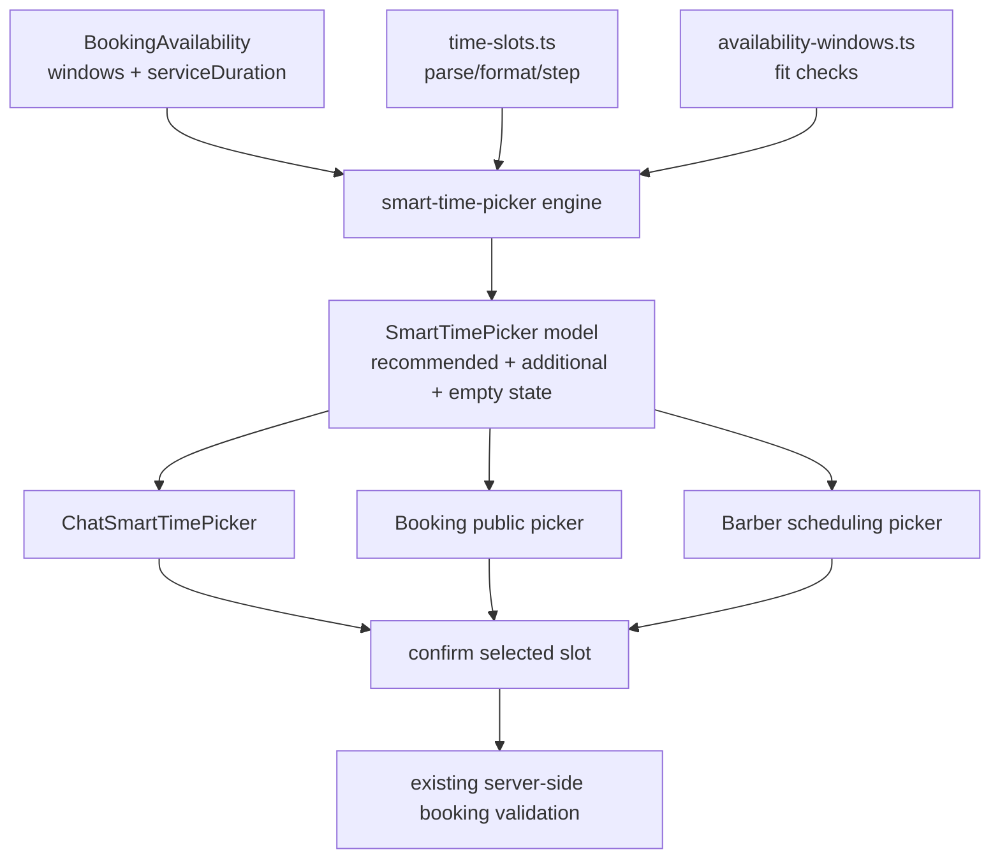
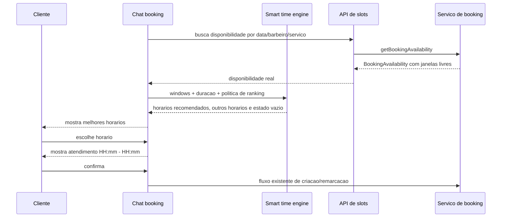
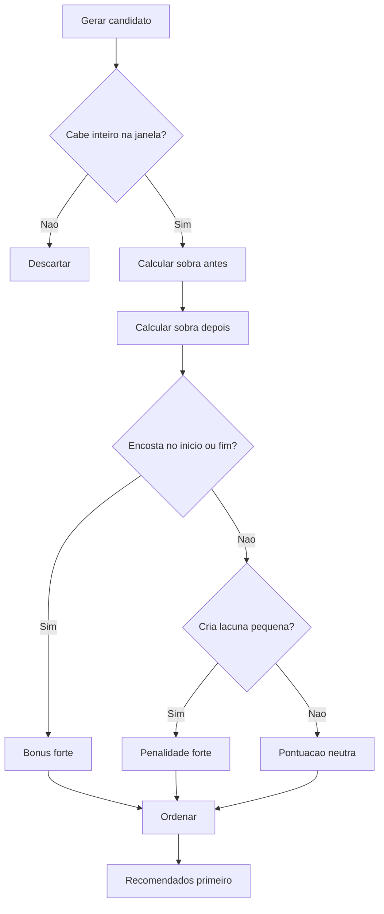

# Design — Booking Smart Time Picker

## Visão Geral

Esta feature substitui a etapa atual de horário por um seletor inteligente que
prioriza decisão rápida do cliente e compactação operacional da agenda. O
cliente deixa de digitar "início exato" e passa a escolher entre horários
prontos, com a primeira tela mostrando apenas as melhores opções.

A regra central é uma ordenação determinística: gerar todos os horários
realmente agendáveis a partir da disponibilidade existente, pontuar a qualidade
do encaixe e entregar grupos de apresentação para a UI. A validação server-side
continua sendo a fonte de verdade; o novo seletor melhora orientação, conversão
e qualidade operacional antes da submissão.

### Goals

- Reduzir esforço cognitivo do cliente na escolha de horário.
- Exibir apenas horários confirmáveis na UI principal.
- Ordenar horários por qualidade de encaixe para reduzir lacunas improdutivas.
- Centralizar geração e ranking para chat, booking público e agenda privada.
- Manter uma primeira versão simples, testável e ajustável.

### Non-Goals

- Não alterar jornada de trabalho, ausências, bloqueios ou duração dos serviços.
- Não substituir a validação server-side de disponibilidade.
- Não criar otimização global de agenda com solver complexo.
- Não adicionar preço dinâmico, fila de espera ou overbooking.
- Não redesenhar etapas de serviço, barbeiro, data, dados do cliente ou checkout.

## Arquitetura

### Existing Architecture Analysis

A base atual já tem peças importantes:

| Camada | Arquivo | Papel atual |
| --- | --- | --- |
| Disponibilidade server-side | `src/services/booking.ts` | Carrega barbeiro, serviço, jornada, ausências, agendamentos e retorna `BookingAvailability`. |
| API de slots | `src/app/api/slots/route.ts` e `src/app/api/barbers/me/slots/route.ts` | Expõe disponibilidade para superfícies de booking. |
| Janela e encaixe | `src/lib/booking/availability-windows.ts` | Calcula janelas livres e valida se um atendimento cabe. |
| Feedback atual | `src/lib/booking/time-selection-feedback.ts` | Explica seleção manual e gera inícios válidos. |
| Normalização | `src/utils/time-slots.ts` | Centraliza parsing, conversão e step de 5 minutos. |
| UI booking público | `src/components/booking/TimeSlotGrid.tsx` | Mostra janelas e input manual. |
| UI chat | `src/components/booking/chat/ChatTimeSlotSelector.tsx` | Mostra janelas e input manual no fluxo conversacional. |
| UI agenda privada | `src/components/barber-scheduling/TimeSlotsSection.tsx` | Mostra janelas e seleção para barbeiro. |

A nova spec não deve duplicar regras server-side. Ela deve consumir
`BookingAvailability.windows` e `serviceDuration` como entrada mínima, mantendo
o backend responsável por remover conflitos reais.

### Architecture Pattern & Boundary Map



**Architecture Integration**:

- Selected pattern: motor puro de domínio + componentes finos de apresentação.
- Domain/feature boundaries: geração, pontuação e agrupamento em `src/lib/booking`;
  UI em `src/components/booking` e `src/components/barber-scheduling`.
- Existing patterns preserved: `BookingAvailability`, `AvailabilityWindow`,
  `BOOKING_START_TIME_STEP_MINUTES`, helpers de parsing/format e validação final
  server-side.
- SDD aplicado: motor, UI do chat, reutilização nas demais superfícies e
  validação ficam em etapas separadas, com testes próprios e possibilidade de
  execução paralela após o contrato central.

### Technology Stack

| Layer | Choice / Version | Role in Feature | Notes |
| --- | --- | --- | --- |
| Frontend / UI | React 19 + Tailwind | Renderizar botões de horário, grupos e confirmação | Reusar tokens e primitives existentes. |
| Business / Services | `src/lib/booking` | Gerar candidatos, pontuar encaixes e montar modelo da UI | Funções puras com Vitest. |
| Shared Utils | `src/utils/time-slots.ts` | Parse, format, step e normalização | Não duplicar conversão de horário. |
| Server Boundary | APIs existentes de slots | Fonte da disponibilidade real | Sem nova API na primeira versão. |
| Testing | Vitest + Testing Library | TDD do motor e das superfícies | Foco inicial no chat. |

## System Flows

### Fluxo Principal



### Pontuação Anti-Lacunas



## Requirements Traceability

| Requirement | Summary | Components | Interfaces | Flows |
| --- | --- | --- | --- | --- |
| 1 | Escolha simples | `SmartTimePicker`, chat picker | `SmartTimePickerViewModel` | Fluxo principal |
| 2 | Apenas horários agendáveis | smart engine, disponibilidade existente | `SmartTimeOption` | Fluxo principal |
| 3 | Reduzir lacunas | scoring engine | `SmartTimeOption.score` | Pontuação anti-lacunas |
| 4 | Expandir opções | UI groups | `SmartTimeGroup` | Fluxo principal |
| 5 | Indisponibilidade acionável | empty state model | `SmartTimePickerViewModel.emptyState` | Fluxo principal |
| 6 | Regras centralizadas | `src/lib/booking` | pure functions | Todos |

## Components and Interfaces

### Resumo

| Component | Domain/Layer | Intent | Req Coverage | Key Dependencies | Contracts |
| --- | --- | --- | --- | --- | --- |
| `buildSmartTimePickerModel` | Business / `src/lib/booking` | Gerar opções recomendadas e demais opções | 1, 2, 3, 4, 5, 6 | `time-slots`, `AvailabilityWindow` | Service |
| `scoreSmartTimeOption` | Business / `src/lib/booking` | Pontuar qualidade de encaixe | 3, 6 | `parseTimeToMinutes` | Service |
| `SmartTimePicker` | UI shared | Renderizar grupos de horário e confirmação | 1, 4, 5 | `Button`, tokens | State |
| `ChatTimeSlotSelector` | UI chat | Consumir novo picker no chat | 1, 2, 4, 5 | `SmartTimePicker` | State |
| `TimeSlotGrid` | UI public booking | Futuro consumidor do mesmo picker | 2, 6 | `SmartTimePicker` | State |
| `TimeSlotsSection` | UI barber scheduling | Futuro consumidor do mesmo picker | 2, 6 | `SmartTimePicker` | State |

### Business / Booking

#### `buildSmartTimePickerModel`

| Field | Detail |
| --- | --- |
| Intent | Transformar janelas livres em modelo de UI com recomendados, demais horários e estado vazio. |
| Requirements | 1, 2, 3, 4, 5, 6 |

**Responsibilities & Constraints**

- Gerar candidatos em múltiplos de `BOOKING_START_TIME_STEP_MINUTES`.
- Descartar candidatos cujo atendimento completo não cabe na janela.
- Pontuar cada candidato por qualidade de encaixe.
- Separar opções recomendadas das opções adicionais.
- Agrupar opções por período do dia quando útil para a UI.
- Não saber nada sobre React, estado de formulário ou copy visual final.

##### Service Interface

```typescript
import type { AvailabilityWindow } from "@/types/booking";

export type SmartTimeQuality = "best" | "good" | "neutral" | "poor";

export interface SmartTimeOption {
  startTime: string;
  endTime: string;
  windowStartTime: string;
  windowEndTime: string;
  quality: SmartTimeQuality;
  score: number;
  reasons: SmartTimeReason[];
  isRecommended: boolean;
}

export type SmartTimeReason =
  | "window_start"
  | "window_end"
  | "keeps_large_remaining_window"
  | "creates_small_gap"
  | "splits_window_middle";

export interface SmartTimeGroup {
  id: "recommended" | "morning" | "afternoon" | "evening" | "additional";
  label: string;
  options: SmartTimeOption[];
}

export interface SmartTimePickerViewModel {
  groups: SmartTimeGroup[];
  recommendedOptions: SmartTimeOption[];
  additionalOptions: SmartTimeOption[];
  totalAvailableCount: number;
  hasMoreOptions: boolean;
  emptyState: SmartTimeEmptyState | null;
}

export interface SmartTimeEmptyState {
  title: string;
  message: string;
  primaryAction: "choose_another_date" | "choose_another_barber" | null;
}

export interface BuildSmartTimePickerModelParams {
  windows: AvailabilityWindow[];
  serviceDurationMinutes: number;
  stepMinutes?: number;
  maxRecommendedOptions?: number;
  minBookableGapMinutes?: number;
}

export function buildSmartTimePickerModel(
  params: BuildSmartTimePickerModelParams,
): SmartTimePickerViewModel;
```

- Preconditions: `windows` já vem da disponibilidade server-side; duração do
  serviço é positiva; horários usam formato `HH:mm`.
- Postconditions: todas as opções retornadas são agendáveis; recomendados são
  ordenados por `score` desc e desempate por horário asc.
- Invariants: `recommendedOptions` e `additionalOptions` não duplicam o mesmo
  `startTime`; nenhuma opção duplica `startTime` dentro da mesma data.

#### `scoreSmartTimeOption`

| Field | Detail |
| --- | --- |
| Intent | Calcular pontuação determinística para reduzir lacunas. |
| Requirements | 3, 6 |

**Scoring v1**

| Condição | Ajuste | Motivo |
| --- | ---: | --- |
| Começa no início da janela | `+40` | Preenche de frente para trás. |
| Termina no fim da janela | `+40` | Encosta no próximo bloqueio/fim de expediente. |
| Deixa sobra antes igual a `0` | `+20` | Evita lacuna anterior. |
| Deixa sobra depois igual a `0` | `+20` | Evita lacuna posterior. |
| Deixa sobra positiva menor que `minBookableGapMinutes` antes | `-35` | Cria buraco difícil de vender. |
| Deixa sobra positiva menor que `minBookableGapMinutes` depois | `-35` | Cria buraco difícil de vender. |
| Divide a janela no meio com sobras dos dois lados | `-15` | Fragmenta a agenda. |
| Horário mais cedo em empate | desempate | Mantém comportamento previsível para cliente. |

`minBookableGapMinutes` deve começar como a menor duração de serviço conhecida
quando disponível. Se a UI não tiver essa informação, usar fallback conservador
de `serviceDurationMinutes`.

### UI

#### `SmartTimePicker`

| Field | Detail |
| --- | --- |
| Intent | Exibir modelo pronto de horários sem expor regras técnicas. |
| Requirements | 1, 4, 5 |

**Responsibilities & Constraints**

- Mostrar seção principal de recomendados.
- Mostrar confirmação do atendimento após seleção.
- Esconder opções adicionais até ação explícita.
- Agrupar opções adicionais por manhã/tarde/noite ou outro agrupamento simples.
- Usar botões com dimensões estáveis, sem layout shift.
- Não renderizar input manual por padrão no fluxo do cliente.

##### State Management

- Estado local: `selectedStartTime`, `showMoreOptions`.
- Entrada controlada: `model`, `selectedOption`, `onSelectOption`.
- Persistência: nenhuma.
- Consistência: se o modelo mudar e o horário selecionado sumir, limpar seleção.

**Copy recomendada**

- Título: `Escolha um horário`
- Grupo principal: `Melhores horários`
- Expansão: `Ver mais horários`
- Confirmação: `Atendimento: 09:00 - 10:00`
- Empty state: `Nenhum horário disponível para esta combinação.`

## Data Models

Não há mudança de banco prevista.

### Domain Model

- `AvailabilityWindow`: fonte de intervalos livres.
- `SmartTimeOption`: opção agendável enriquecida com score e qualidade.
- `SmartTimePickerViewModel`: contrato de apresentação para as superfícies.

### Business Rules & Invariants

- Uma opção só existe se `startTime + serviceDurationMinutes <= windowEndTime`.
- O ranking não pode tornar uma opção inválida visível.
- A UI principal deve priorizar `best` e `good`.
- Opções `poor` podem existir em "mais horários", mas não devem aparecer como
  recomendadas quando houver alternativa melhor.
- A validação final de criação/remarcação continua no backend.

## Error Handling

### Error Strategy

O novo fluxo reduz erros por construção: a UI não oferece horário inválido. Os
erros restantes são estados de disponibilidade ou corrida entre renderização e
confirmação.

### Error Categories and Responses

| Categoria | Condição | Resposta UI |
| --- | --- | --- |
| Sem horários | `totalAvailableCount === 0` | Mensagem curta + ação para escolher outra data. |
| Seleção expirada | opção selecionada não existe no novo modelo | Limpar seleção e pedir nova escolha. |
| Conflito na confirmação | backend rejeita por indisponibilidade | Mostrar que o horário acabou de ser preenchido e recarregar opções. |
| Erro de rede | falha ao buscar slots | Estado de erro padrão com tentar novamente. |

## Testing Strategy

### Unit Tests

- `src/lib/booking/__tests__/smart-time-picker.test.ts`
  - gera apenas opções que cabem dentro das janelas.
  - recomenda início da janela antes de horários no meio.
  - recomenda horário que termina no fim da janela.
  - penaliza opção que cria lacuna menor que `minBookableGapMinutes`.
  - ordena empate por horário ascendente.
  - retorna empty state quando não há opções.

### Component Tests

- `src/components/booking/__tests__/SmartTimePicker.test.tsx`
  - mostra "Melhores horários" com lista limitada.
  - confirma seleção com intervalo `HH:mm - HH:mm`.
  - esconde opções adicionais até o usuário expandir.
  - limpa seleção quando a opção selecionada deixa de existir.
  - renderiza estado vazio com ação apropriada.

### Chat Integration Tests

- `src/components/booking/chat/__tests__/ChatTimeSlotSelector.test.tsx`
  - não exibe "Janelas livres" nem input manual no fluxo principal.
  - usa o novo picker para selecionar e confirmar horário.
  - mantém ação de escolher outra data quando não há horários.

### Reuse Tests

- Após estabilizar no chat, adicionar testes focados para `TimeSlotGrid` e
  `TimeSlotsSection` quando essas superfícies forem migradas para o mesmo
  componente.

### Project Verification Baseline

- Seguir RED -> GREEN -> REFACTOR para motor e UI.
- Rodar testes focados primeiro:
  - `pnpm test src/lib/booking/__tests__/smart-time-picker.test.ts`
  - `pnpm test src/components/booking/__tests__/SmartTimePicker.test.tsx`
  - `pnpm test src/components/booking/chat/__tests__/ChatTimeSlotSelector.test.tsx`
- Ao final da implementação, rodar `pnpm lint`, `pnpm type-check` e os testes
  de booking impactados.
- Validar visualmente o chat em mobile/desktop, light/dark, com cenários:
  recomendados, mais horários, sem horários e conflito após recarregamento.
