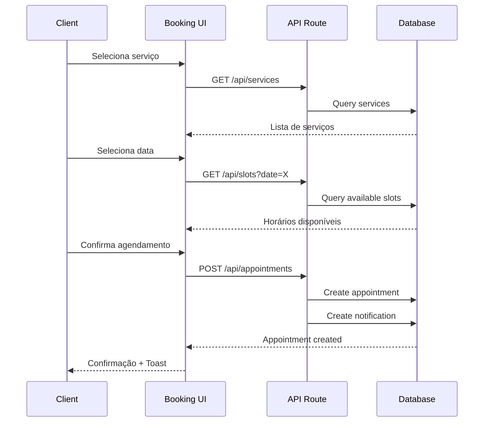

# Design Document - Booking System

## Overview

Sistema de agendamento para a barbearia Gold Mustache construído com Next.js 15, Prisma, Supabase Auth e React Query. O sistema permite que clientes agendem serviços de forma autônoma e barbeiros gerenciem sua agenda com notificações em tempo real.

### Princípios de Design
- **Mobile-first**: Interface otimizada para dispositivos móveis
- **Real-time**: Atualizações instantâneas via Supabase Realtime
- **Simplicidade**: Fluxo de agendamento em 3 passos (serviço → data → horário)
- **Feedback imediato**: Toast notifications para todas as ações

## Architecture

```mermaid
graph TB
    subgraph "Frontend (Next.js)"
        A[Client Booking Page] --> D[Booking Service]
        B[Barber Dashboard] --> D
        C[Notifications Panel] --> E[Notification Service]
    end
    
    subgraph "API Layer"
        D --> F[/api/appointments]
        E --> G[/api/notifications]
        F --> H[Prisma Client]
        G --> H
    end
    
    subgraph "Database (Supabase)"
        H --> I[(PostgreSQL)]
        I --> J[Realtime Subscriptions]
    end
    
    J --> C
    J --> B
```

### Fluxo de Agendamento


## Components and Interfaces

### Client Components

```typescript
// src/components/booking/ServiceSelector.tsx
interface ServiceSelectorProps {
  services: Service[];
  selectedService: Service | null;
  onSelect: (service: Service) => void;
}

// src/components/booking/DatePicker.tsx
interface DatePickerProps {
  selectedDate: Date | null;
  onSelect: (date: Date) => void;
  disabledDates?: Date[];
}

// src/components/booking/TimeSlotGrid.tsx
interface TimeSlotGridProps {
  slots: TimeSlot[];
  selectedSlot: TimeSlot | null;
  onSelect: (slot: TimeSlot) => void;
}

// src/components/booking/BookingConfirmation.tsx
interface BookingConfirmationProps {
  appointment: Appointment;
  onClose: () => void;
}
```

### Barber Dashboard Components

```typescript
// src/components/dashboard/DailySchedule.tsx
interface DailyScheduleProps {
  date: Date;
  appointments: Appointment[];
  onCancelAppointment: (id: string, reason: string) => void;
}

// src/components/dashboard/WeeklyCalendar.tsx
interface WeeklyCalendarProps {
  weekStart: Date;
  appointments: Appointment[];
  onDateSelect: (date: Date) => void;
}

// src/components/dashboard/AppointmentCard.tsx
interface AppointmentCardProps {
  appointment: Appointment;
  onCancel: (reason: string) => void;
  showClientInfo: boolean;
}
```

### Notification Components

```typescript
// src/components/notifications/NotificationBell.tsx
interface NotificationBellProps {
  unreadCount: number;
  onClick: () => void;
}

// src/components/notifications/NotificationList.tsx
interface NotificationListProps {
  notifications: Notification[];
  onMarkAsRead: (id: string) => void;
}
```

### Service Interfaces

```typescript
// src/services/booking.ts
interface BookingService {
  getServices(): Promise<Service[]>;
  getAvailableSlots(date: Date, barberId?: string): Promise<TimeSlot[]>;
  createAppointment(data: CreateAppointmentInput): Promise<Appointment>;
  cancelAppointment(id: string, reason?: string): Promise<Appointment>;
  getClientAppointments(clientId: string): Promise<Appointment[]>;
  getBarberAppointments(barberId: string, dateRange: DateRange): Promise<Appointment[]>;
}

// src/services/notification.ts
interface NotificationService {
  getNotifications(userId: string): Promise<Notification[]>;
  markAsRead(notificationId: string): Promise<void>;
  subscribeToNotifications(userId: string, callback: (n: Notification) => void): () => void;
}
```

## Data Models

### Prisma Schema Extensions

```prisma
model Service {
  id          String   @id @default(uuid())
  slug        String   @unique
  name        String
  description String?
  duration    Int      // em minutos
  price       Decimal  @db.Decimal(10, 2)
  active      Boolean  @default(true)
  createdAt   DateTime @default(now()) @map("created_at")
  updatedAt   DateTime @updatedAt @map("updated_at")
  
  appointments Appointment[]
  barbers      BarberService[]
  
  @@map("services")
}

model Barber {
  id        String   @id @default(uuid())
  userId    String   @unique @map("user_id")
  name      String
  avatarUrl String?  @map("avatar_url")
  active    Boolean  @default(true)
  createdAt DateTime @default(now()) @map("created_at")
  updatedAt DateTime @updatedAt @map("updated_at")
  
  appointments  Appointment[]
  services      BarberService[]
  workingHours  WorkingHours[]
  
  @@map("barbers")
}

model BarberService {
  barberId  String @map("barber_id")
  serviceId String @map("service_id")
  
  barber  Barber  @relation(fields: [barberId], references: [id], onDelete: Cascade)
  service Service @relation(fields: [serviceId], references: [id], onDelete: Cascade)
  
  @@id([barberId, serviceId])
  @@map("barber_services")
}

model WorkingHours {
  id        String   @id @default(uuid())
  barberId  String   @map("barber_id")
  dayOfWeek Int      @map("day_of_week") // 0=Sunday, 6=Saturday
  startTime String   @map("start_time") // "09:00"
  endTime   String   @map("end_time")   // "18:00"
  breakStart String? @map("break_start")
  breakEnd   String? @map("break_end")
  
  barber Barber @relation(fields: [barberId], references: [id], onDelete: Cascade)
  
  @@unique([barberId, dayOfWeek])
  @@map("working_hours")
}

model Appointment {
  id        String            @id @default(uuid())
  clientId  String            @map("client_id")
  barberId  String            @map("barber_id")
  serviceId String            @map("service_id")
  date      DateTime          @db.Date
  startTime String            @map("start_time") // "10:30"
  endTime   String            @map("end_time")   // "11:00"
  status    AppointmentStatus @default(CONFIRMED)
  cancelReason String?        @map("cancel_reason")
  createdAt DateTime          @default(now()) @map("created_at")
  updatedAt DateTime          @updatedAt @map("updated_at")
  
  client  Profile @relation(fields: [clientId], references: [id])
  barber  Barber  @relation(fields: [barberId], references: [id])
  service Service @relation(fields: [serviceId], references: [id])
  
  @@unique([barberId, date, startTime])
  @@map("appointments")
}

enum AppointmentStatus {
  CONFIRMED
  CANCELLED_BY_CLIENT
  CANCELLED_BY_BARBER
  COMPLETED
  NO_SHOW
}

model Notification {
  id        String           @id @default(uuid())
  userId    String           @map("user_id")
  type      NotificationType
  title     String
  message   String
  data      Json?            // metadata adicional
  read      Boolean          @default(false)
  createdAt DateTime         @default(now()) @map("created_at")
  
  @@map("notifications")
}

enum NotificationType {
  APPOINTMENT_CONFIRMED
  APPOINTMENT_CANCELLED
  APPOINTMENT_REMINDER
}
```

### TypeScript Types

```typescript
// src/types/booking.ts
interface TimeSlot {
  time: string;      // "10:30"
  available: boolean;
  barberId?: string;
}

interface CreateAppointmentInput {
  serviceId: string;
  barberId: string;
  date: string;      // "2025-12-15"
  startTime: string; // "10:30"
}

interface DateRange {
  start: Date;
  end: Date;
}
```


## Correctness Properties

*A property is a characteristic or behavior that should hold true across all valid executions of a system-essentially, a formal statement about what the system should do. Properties serve as the bridge between human-readable specifications and machine-verifiable correctness guarantees.*

### Property 1: Available slots exclude occupied times
*For any* date and set of existing appointments, the available time slots returned SHALL NOT include any time that overlaps with an existing confirmed appointment.
**Validates: Requirements 1.2, 1.4**

### Property 2: Booking creates confirmed appointment
*For any* valid booking input (service, barber, date, available time), creating an appointment SHALL result in an Appointment with status CONFIRMED and all input fields preserved.
**Validates: Requirements 1.3**

### Property 3: Appointment persistence round-trip
*For any* created appointment, immediately querying the database SHALL return an appointment with identical field values.
**Validates: Requirements 1.5, 6.4**

### Property 4: Future appointments sorted by date
*For any* client with appointments, retrieving their appointments SHALL return only future appointments sorted by date in ascending order.
**Validates: Requirements 2.1**

### Property 5: Cancellation time window enforcement
*For any* appointment, cancellation by client SHALL succeed if and only if the appointment is more than 2 hours in the future.
**Validates: Requirements 2.2, 2.3**

### Property 6: Cancelled slot becomes available
*For any* cancelled appointment (by client or barber), the previously occupied time slot SHALL appear in available slots for that date.
**Validates: Requirements 2.4, 4.3**

### Property 7: Barber appointments filtered by date
*For any* barber and date range, retrieved appointments SHALL only include appointments within that date range, sorted chronologically.
**Validates: Requirements 3.1, 3.2, 3.3**

### Property 8: Appointment display completeness
*For any* appointment, the display data SHALL include client name, service type, start time, and status.
**Validates: Requirements 3.4**

### Property 9: Barber cancellation requires reason
*For any* barber cancellation attempt, the operation SHALL fail if no cancellation reason is provided.
**Validates: Requirements 4.2**

### Property 10: Appointment creation triggers client notification
*For any* created appointment, a notification of type APPOINTMENT_CONFIRMED SHALL be created for the client.
**Validates: Requirements 5.1**

### Property 11: Cancellation triggers appropriate notification
*For any* cancelled appointment, a notification SHALL be sent to the other party (client notified if barber cancels, barber notified if client cancels).
**Validates: Requirements 5.2, 5.3**

### Property 12: Slots respect working hours
*For any* time slot query, returned available slots SHALL only include times within the barber's configured working hours and outside break periods.
**Validates: Requirements 6.2**

### Property 13: Services filtered by barber association
*For any* barber, the available services SHALL only include services associated with that barber.
**Validates: Requirements 6.3**

### Property 14: Appointment serialization round-trip
*For any* valid Appointment object, serializing to JSON and deserializing back SHALL produce an object with identical field values.
**Validates: Requirements 7.1, 7.2, 7.3**

## Error Handling

### Client-Side Errors
| Error | Handling |
|-------|----------|
| Slot already booked | Toast error + refresh available slots |
| Cancellation too late | Toast warning with time remaining |
| Network failure | Retry with exponential backoff + offline indicator |
| Invalid date selection | Disable past dates in picker |

### Server-Side Errors
| Error | HTTP Status | Response |
|-------|-------------|----------|
| Slot conflict | 409 Conflict | `{ error: "SLOT_OCCUPIED", message: "..." }` |
| Cancellation denied | 400 Bad Request | `{ error: "CANCELLATION_TOO_LATE", message: "..." }` |
| Unauthorized | 401 Unauthorized | Redirect to login |
| Not found | 404 Not Found | `{ error: "NOT_FOUND", message: "..." }` |
| Validation error | 422 Unprocessable | `{ error: "VALIDATION_ERROR", details: [...] }` |

### Validation with Zod

```typescript
// src/lib/validations/booking.ts
import { z } from "zod";

export const createAppointmentSchema = z.object({
  serviceId: z.string().uuid(),
  barberId: z.string().uuid(),
  date: z.string().regex(/^\d{4}-\d{2}-\d{2}$/),
  startTime: z.string().regex(/^\d{2}:\d{2}$/),
});

export const cancelAppointmentSchema = z.object({
  appointmentId: z.string().uuid(),
  reason: z.string().min(1).max(500).optional(),
});
```

## Testing Strategy

### Property-Based Testing Library
- **Library**: fast-check (already in devDependencies)
- **Minimum iterations**: 100 per property test

### Unit Tests
- Service layer functions (booking, notification)
- Validation schemas
- Time slot calculation utilities
- Date formatting helpers

### Property-Based Tests
Each correctness property will be implemented as a property-based test using fast-check:

```typescript
// Example structure for property tests
// src/services/__tests__/booking.property.test.ts

import { fc } from "fast-check";
import { describe, it, expect } from "vitest";

describe("Booking Service Properties", () => {
  // **Feature: booking-system, Property 1: Available slots exclude occupied times**
  it("available slots exclude occupied times", () => {
    fc.assert(
      fc.property(
        dateArbitrary,
        appointmentsArbitrary,
        (date, appointments) => {
          const slots = getAvailableSlots(date, appointments);
          const occupiedTimes = appointments.map(a => a.startTime);
          return slots.every(s => !occupiedTimes.includes(s.time));
        }
      ),
      { numRuns: 100 }
    );
  });
});
```

### Test File Organization
```
src/
├── services/
│   ├── booking.ts
│   ├── notification.ts
│   └── __tests__/
│       ├── booking.test.ts           # Unit tests
│       ├── booking.property.test.ts  # Property tests
│       ├── notification.test.ts
│       └── notification.property.test.ts
├── lib/
│   └── validations/
│       ├── booking.ts
│       └── __tests__/
│           └── booking.test.ts
└── utils/
    ├── time-slots.ts
    └── __tests__/
        ├── time-slots.test.ts
        └── time-slots.property.test.ts
```

### Integration Tests
- API route handlers with mocked database
- End-to-end booking flow
- Notification delivery verification
