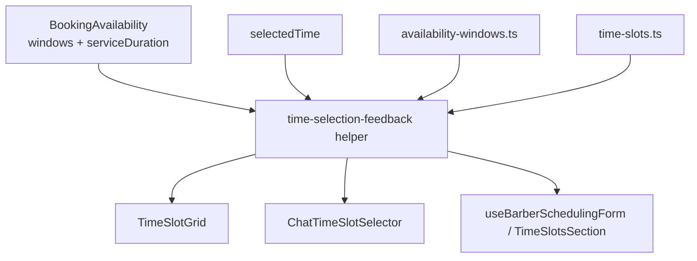
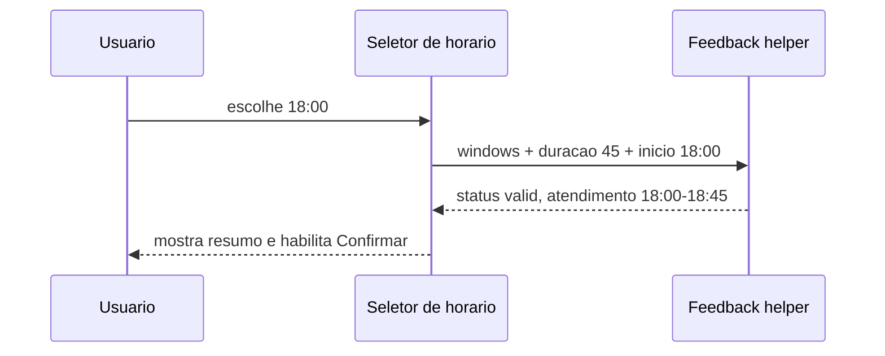
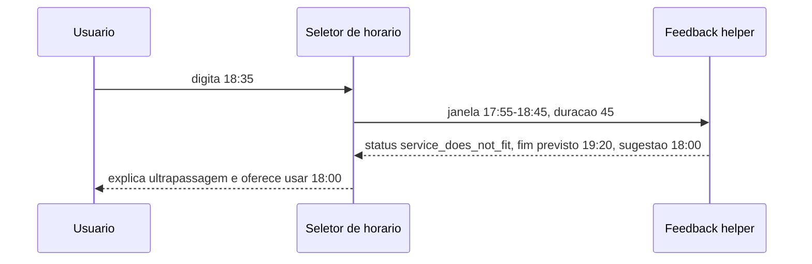

# Design — Booking Time Selection UX

## Visão geral

Esta feature melhora a compreensão do seletor de início exato nas três
superfícies que hoje exibem janelas livres: booking público, chat de
agendamento e agenda privada do barbeiro. O valor principal é transformar uma
mensagem genérica de erro em feedback calculado: serviço selecionado, duração,
início, término previsto, fim da janela e correção sugerida.

A mudança é brownfield e deve reaproveitar as regras existentes em
`src/lib/booking/availability-windows.ts` e `src/utils/time-slots.ts`. O backend
continua como fonte de segurança para criação do agendamento; a UI apenas passa
a orientar melhor o usuário antes da submissão.

### Goals

- Mostrar o intervalo completo do atendimento antes da confirmação.
- Explicar erros por causa real: início fora da janela ou serviço que não cabe.
- Sugerir correções rápidas, especialmente o último início possível.
- Manter comportamento consistente entre chat, booking público e agenda do
  barbeiro.

### Non-Goals

- Não alterar cálculo server-side de disponibilidade.
- Não criar nova entidade ou migração de banco.
- Não remover input manual de horário.
- Não redesenhar o fluxo completo de booking.

## Arquitetura

### Existing Architecture Analysis

Hoje cada superfície calcula o erro de forma parecida:

| Superfície | Arquivo | Estado atual |
| ---------- | ------- | ------------ |
| Booking público | `src/components/booking/TimeSlotGrid.tsx` | Calcula `selectedTimeError` local com `isStartTimeWithinAvailabilityWindows`. |
| Chat | `src/components/booking/chat/ChatTimeSlotSelector.tsx` | Repete a mesma lógica e copy genérica. |
| Agenda do barbeiro | `src/components/barber-scheduling/TimeSlotsSection.tsx` + `src/hooks/useBarberSchedulingForm.ts` | Hook calcula erro; componente apenas exibe. |

O ponto compartilhado correto para cálculo puro permanece em
`src/lib/booking/availability-windows.ts`, que já sabe validar se
`startTime + durationMinutes` cabe dentro das janelas. A nova camada deve expor
um feedback mais rico, sem duplicar regra em componentes.

### Architecture Pattern & Boundary Map



**Architecture Integration**:

- Selected pattern: helper puro compartilhado + componentes de apresentação.
- Domain/feature boundaries: cálculos ficam em `src/lib/booking`; UI apenas
  renderiza resumo, erro e ações.
- Existing patterns preserved: `BOOKING_START_TIME_STEP_MINUTES`,
  `roundTimeUpToSlotBoundary`, `isStartTimeWithinAvailabilityWindows`.
- Steering compliance: TypeScript estrito, funções pequenas, TDD, sem `any`.

### Technology Stack

| Layer | Choice / Version | Role in Feature | Notes |
| ----- | ---------------- | --------------- | ----- |
| Frontend / UI | React 19 + Tailwind | Renderizar resumo, ações rápidas e erro contextual | Reusar `Button`, `Input`, `Label` e tokens existentes. |
| Business / Services | `src/lib/booking` | Calcular encaixe, término previsto e sugestões | Funções puras testáveis. |
| Shared Utils | `src/utils/time-slots.ts` | Converter horários e gerar sub-slots | Usar constantes existentes. |
| Testing | Vitest + Testing Library | RED/GREEN/REFACTOR | Testes unitários e renderização dos componentes. |

## Componentes e Interfaces

### Helper de feedback de seleção

Adicionar um helper puro, preferencialmente em
`src/lib/booking/time-selection-feedback.ts`, para não inflar
`availability-windows.ts`.

```typescript
import type { AvailabilityWindow } from "@/types/booking";

export type TimeSelectionStatus =
  | "empty"
  | "valid"
  | "outside_windows"
  | "service_does_not_fit";

export interface TimeSelectionFeedback {
  status: TimeSelectionStatus;
  selectedStartTime: string | null;
  selectedEndTime: string | null;
  serviceDurationMinutes: number;
  matchingWindow: AvailabilityWindow | null;
  validStartTimes: string[];
  suggestedStartTime: string | null;
  latestStartTimeInWindow: string | null;
}

export interface BuildTimeSelectionFeedbackParams {
  windows: AvailabilityWindow[];
  selectedStartTime: string;
  serviceDurationMinutes: number;
  stepMinutes?: number;
  maxVisibleSuggestions?: number;
}
```

Responsabilidades:

- Calcular `selectedEndTime` com `selectedStartTime + serviceDurationMinutes`.
- Distinguir `outside_windows` de `service_does_not_fit`.
- Gerar inícios válidos respeitando `BOOKING_START_TIME_STEP_MINUTES`.
- Sugerir `latestStartTimeInWindow` quando o início está dentro de uma janela,
  mas o serviço ultrapassa o fim.
- Sugerir a próxima opção válida quando o início está fora das janelas.

Invariantes:

- `validStartTimes` contém apenas horários cujo atendimento inteiro cabe em uma
  janela.
- `latestStartTimeInWindow` é múltiplo do step configurado.
- Se `status === "valid"`, `selectedEndTime` e `matchingWindow` não são `null`.
- Se o horário não puder ser convertido ou arredondado, o status deve ser
  `outside_windows`.

### UI compartilhável de resumo

Pode ser implementado como componente pequeno, por exemplo
`src/components/booking/TimeSelectionSummary.tsx`, ou como markup local usando
o mesmo contrato. A decisão final deve priorizar menor duplicação sem criar
abstração pesada.

Conteúdo recomendado no estado válido:

```text
Serviço: 45 min
Atendimento: 18:00 - 18:45
```

Conteúdo recomendado no estado inválido por duração:

```text
Esse serviço dura 45 min.
Começando às 18:35, terminaria às 19:20, mas essa janela termina às 18:45.
Use 18:00 ou escolha outra janela.
```

Conteúdo recomendado no estado inválido por início fora da janela:

```text
O início precisa estar dentro de uma janela livre.
Próximo início disponível: 17:55.
```

### Superfícies impactadas

| Arquivo | Mudança |
| ------- | ------- |
| `src/components/booking/TimeSlotGrid.tsx` | Consumir helper de feedback, renderizar resumo, sugestões e erro específico. |
| `src/components/booking/chat/ChatTimeSlotSelector.tsx` | Mesmo contrato, mantendo botão sticky existente. |
| `src/hooks/useBarberSchedulingForm.ts` | Trocar erro string local por feedback compartilhado ou helper equivalente. |
| `src/components/barber-scheduling/TimeSlotsSection.tsx` | Renderizar duração, intervalo previsto, ações rápidas e erro contextual. |
| `src/lib/booking/availability-windows.ts` | Manter função booleana existente; opcionalmente reutilizar internamente no helper novo. |
| `src/utils/time-slots.ts` | Reusar `parseTimeToMinutes`, `minutesToTime`, `generateSubSlots`, `BOOKING_START_TIME_STEP_MINUTES`. |

## Fluxos

### Estado válido



### Serviço não cabe



## Error Handling

### Error Strategy

Erros de seleção são erros de regra de negócio no cliente, antes da submissão.
O botão de confirmação permanece desabilitado enquanto o feedback não for
`valid`. A copy deve explicar o que aconteceu e qual ação tomar.

### Error Categories and Responses

| Categoria | Condição | Resposta UI |
| --------- | -------- | ----------- |
| `empty` | Sem horário selecionado | Sem erro; orientar seleção. |
| `outside_windows` | Início não pertence às janelas livres | Mostrar que o início precisa estar dentro de uma janela e sugerir próximo válido. |
| `service_does_not_fit` | Início está na janela, mas duração ultrapassa fim | Mostrar duração, término previsto, fim da janela e último início possível. |
| `valid` | Atendimento cabe inteiro | Mostrar intervalo do atendimento e habilitar confirmação. |

## Testing Strategy

### Unit Tests

- `src/lib/booking/__tests__/time-selection-feedback.test.ts`
  - `18:00` em `17:55 - 18:45` com duração `45` retorna `valid` e fim `18:45`.
  - `18:35` na mesma janela retorna `service_does_not_fit`, fim `19:20` e
    sugestão `18:00`.
  - Horário fora de todas as janelas retorna `outside_windows` e próxima opção
    válida quando existir.
  - `validStartTimes` nunca inclui horários cujo término ultrapassa a janela.
  - Horários quebrados são normalizados/rejeitados conforme a regra de step.

### Component Tests

- `src/components/booking/__tests__/TimeSlotGrid.test.tsx`
  - Renderiza duração e atendimento no estado válido.
  - Mostra erro contextual e ação "Usar HH:mm" quando serviço não cabe.
- `src/components/booking/chat/__tests__/ChatTimeSlotSelector.test.tsx`
  - Mantém botão desabilitado em erro e habilitado em estado válido.
  - Preserva ação de escolher outra data quando não há janelas.
- `src/components/barber-scheduling/__tests__/TimeSlotsSection.test.tsx`
  - Exibe resumo de duração, término previsto e erro recebido/calculado.

### Hook Tests

- `src/hooks/__tests__/useBarberSchedulingForm.test.tsx`
  - Cenário com serviço selecionado, janela válida e início que não cabe deve
    expor mensagem específica.
  - Cenário com início válido deve permitir submissão.

### Project Verification Baseline

- Seguir RED -> GREEN -> REFACTOR para helper e componentes.
- Rodar primeiro testes focados:
  - `pnpm test src/lib/booking/__tests__/time-selection-feedback.test.ts`
  - `pnpm test src/components/booking src/components/barber-scheduling src/hooks/__tests__/useBarberSchedulingForm.test.tsx`
- Ao final, rodar `pnpm lint` e `pnpm type-check`.
- Se houver alteração visual relevante, validar manualmente em light/dark nas
  três superfícies.
