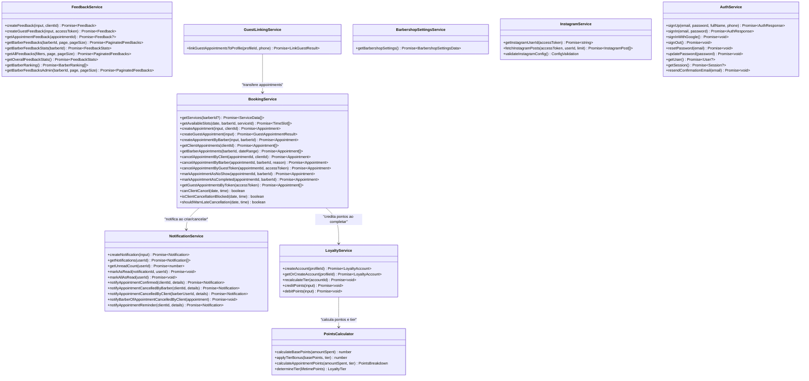
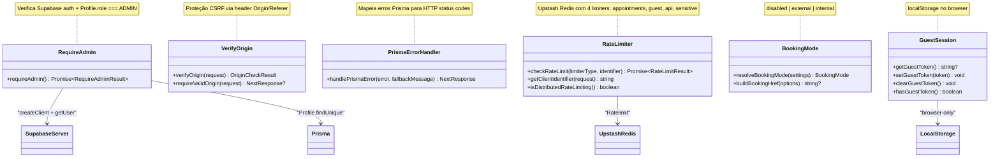
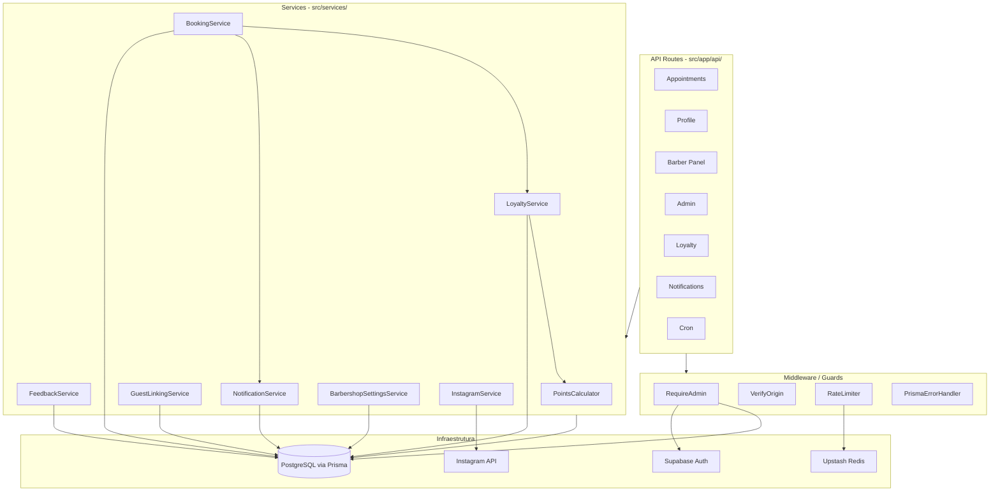

# Gold Mustache — Diagrama de Classes

> Estrutura dos serviços, helpers e suas dependências no backend.
> Cada "classe" representa um módulo (`src/services/` ou `src/lib/`) com seus métodos públicos.

---

## Diagrama de Classes — Services

---

## Diagrama de Classes — Lib (Auth, API, Booking)

---

## Camadas e Dependências

---

## Localização dos Arquivos

| Classe/Módulo | Arquivo |
|---------------|---------|
| BookingService | `src/services/booking.ts` |
| FeedbackService | `src/services/feedback.ts` |
| NotificationService | `src/services/notification.ts` |
| GuestLinkingService | `src/services/guest-linking.ts` |
| BarbershopSettingsService | `src/services/barbershop-settings.ts` |
| InstagramService | `src/services/instagram.ts` |
| AuthService | `src/services/auth.ts` (client-side) |
| LoyaltyService | `src/services/loyalty/loyalty.service.ts` |
| PointsCalculator | `src/services/loyalty/points.calculator.ts` |
| RequireAdmin | `src/lib/auth/requireAdmin.ts` |
| VerifyOrigin | `src/lib/api/verify-origin.ts` |
| PrismaErrorHandler | `src/lib/api/prisma-error-handler.ts` |
| RateLimiter | `src/lib/rate-limit.ts` |
| BookingMode | `src/lib/booking-mode.ts` |
| GuestSession | `src/lib/guest-session.ts` |
