# Gold Mustache — Diagramas de Fluxo e Sequência

> Passo a passo dos processos mais complexos do sistema.
> Cada diagrama usa Mermaid (renderiza no GitHub e VS Code).

---

## 1. Fluxo de Middleware (toda requisição)

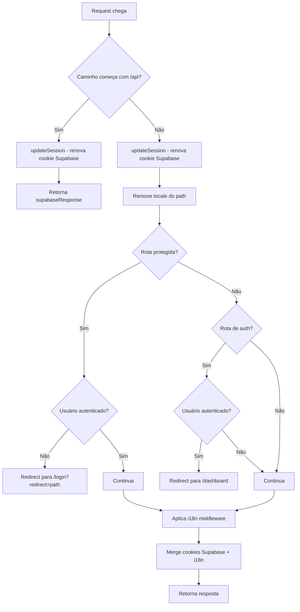

**Rotas protegidas:** `/dashboard`, `/profile`, `/barbeiro`, `/admin`
**Rotas de auth:** `/login`, `/signup`, `/reset-password`
**Locales:** `pt-BR`, `es`, `en`

---

## 2. Fluxo de Autenticação

### 2.1 Cadastro (Email/Senha)

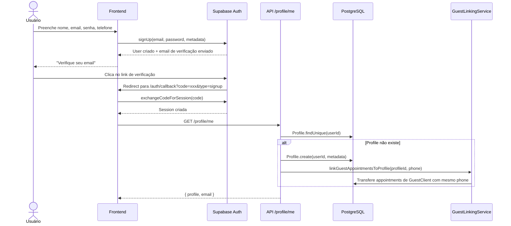

### 2.2 Login com Google (OAuth)

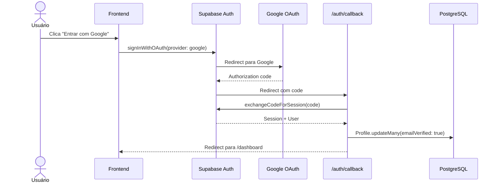

---

## 3. Fluxo de Agendamento (Cliente Autenticado)

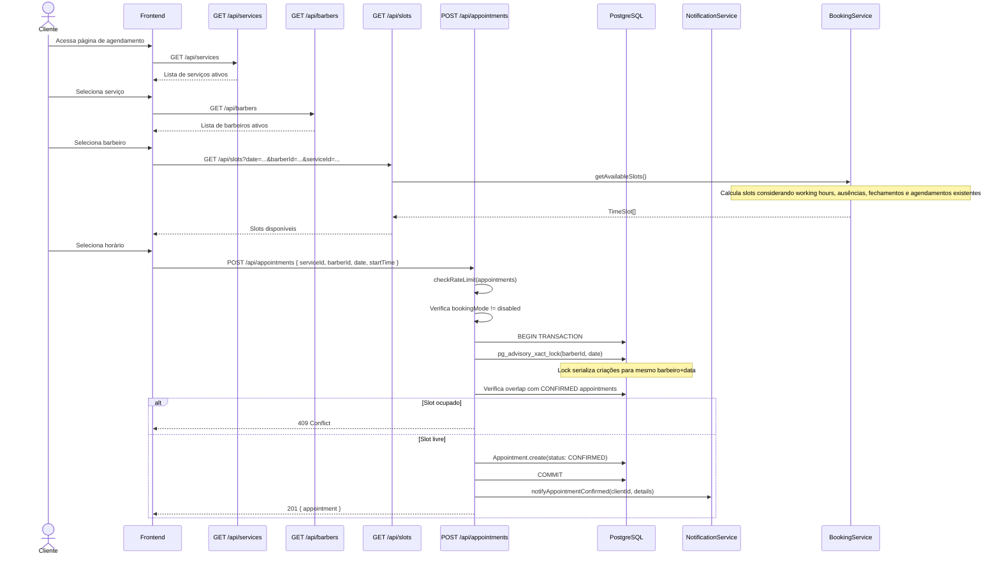

---

## 4. Fluxo de Agendamento (Convidado / Guest)

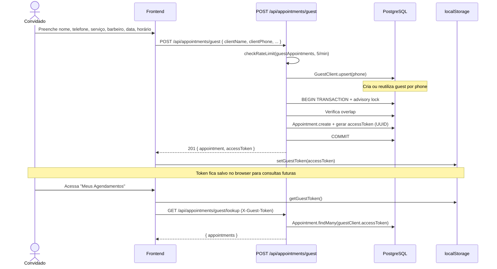

---

## 5. Fluxo de Cancelamento

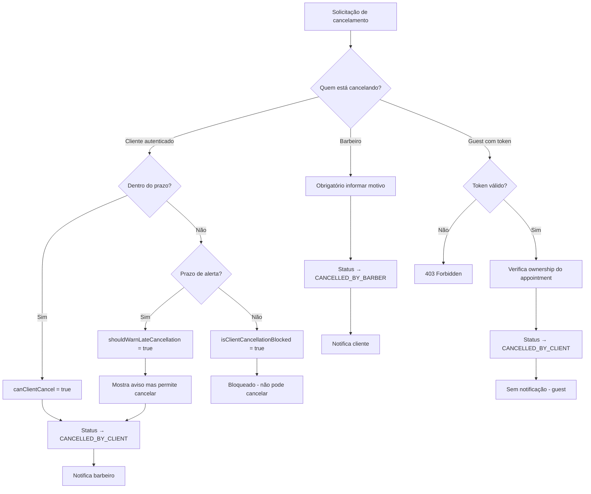

---

## 6. Fluxo de Fidelidade (Loyalty)

### 6.1 Ganhar pontos

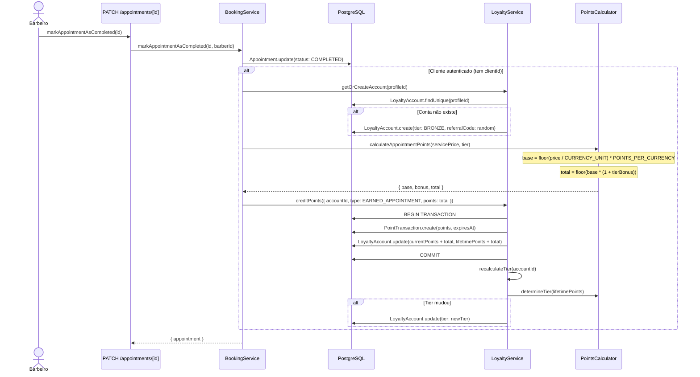

### 6.2 Tiers

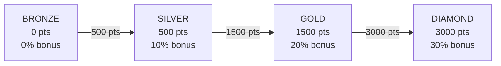

---

## 7. Fluxo de Feedback

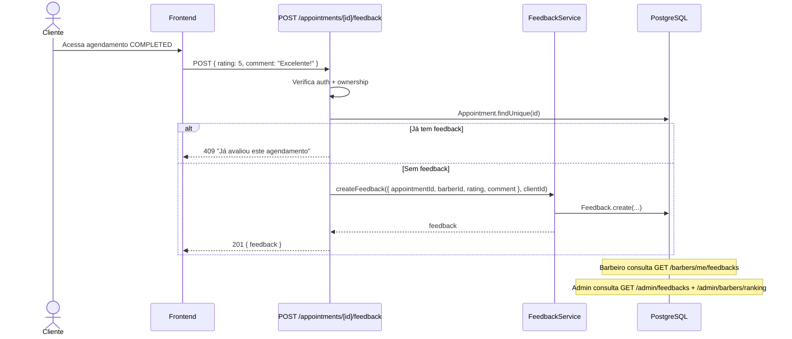

---

## 8. Fluxo de Vinculação Guest → Profile

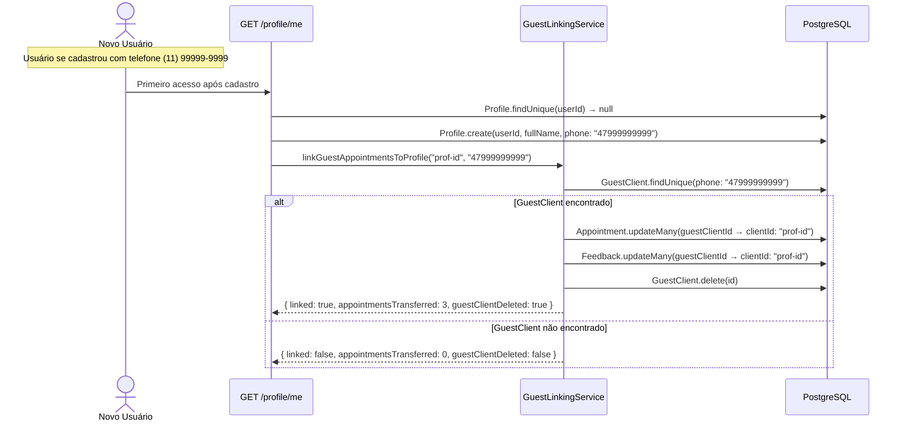

---

## 9. Fluxo da API Route (padrão geral)

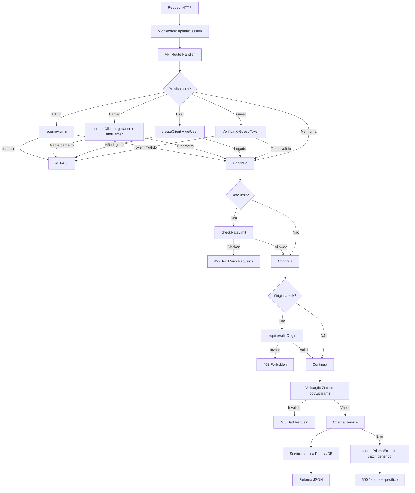
